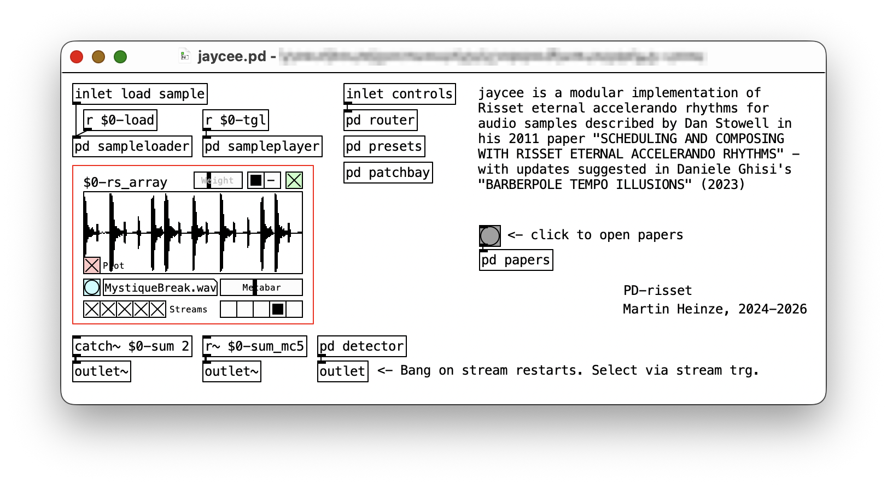
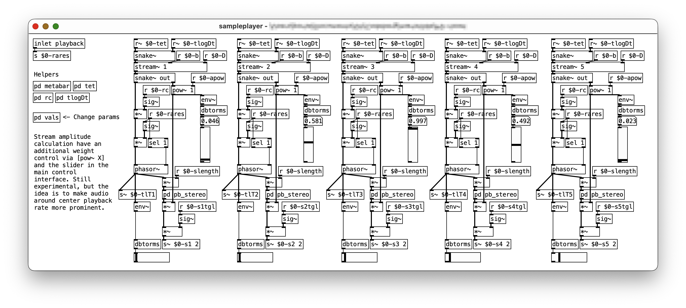
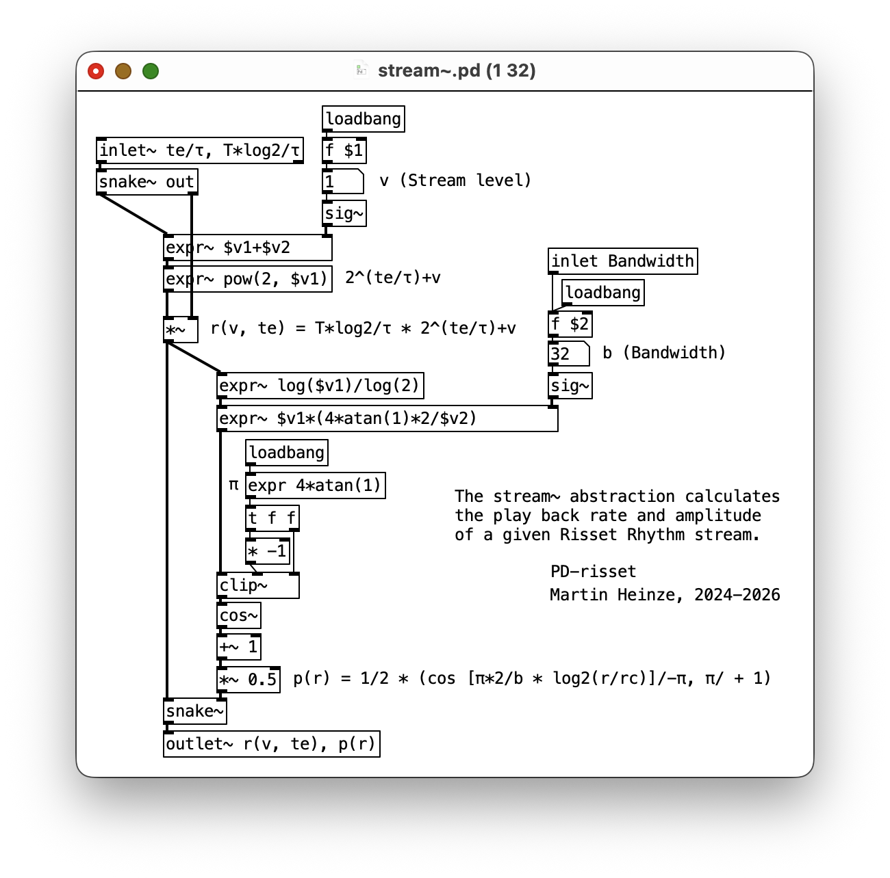
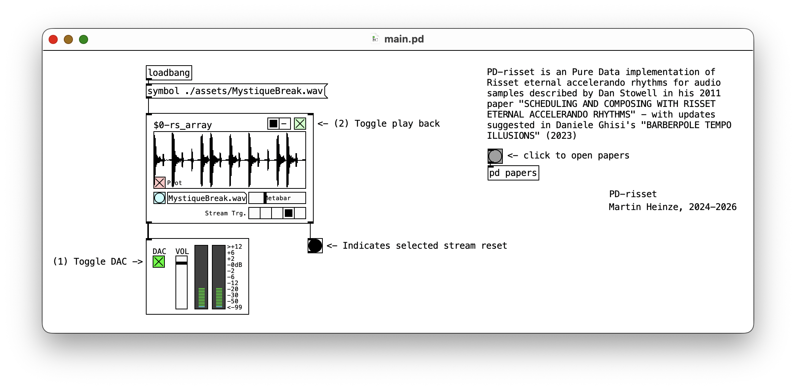

# PD-risset

## Risset eternal accelerando
[Jean-Claude Risset](https://en.wikipedia.org/wiki/Jean-Claude_Risset) described the auditory illusion of an "eternal accelerando", where, similar to Shepard tones for pitch, a rhythm can be structured and played back in a way that creates the [perception of constant acceleration](https://pubs.aip.org/asa/jasa/article-abstract/80/3/961/680513/Pitch-and-rhythm-paradoxes-Comments-on-Auditory?redirectedFrom=fulltext).

In his 2011 paper ["Scheduling and composing with Risset eternal accelerando rhythms"](https://www.semanticscholar.org/paper/Scheduling-and-composing-with-Risset-eternal-Stowell/df6a5bf9566d609b120fe06cd7c2541f6aea453c), Dan Stowell provided a solution for implementing eternal accelerandos on (rhythmic) audio samples by employing variable play back rates and amplitudes distributed to a number of sample play back streams that run synchronized.
Daniele Ghisi updated and enhanced this approach in ["Barberpole tempo illusions"](https://www.tandfonline.com/doi/abs/10.1080/17459737.2021.2001699) (2023). 

## Implementation for Pure Data
This repo contains a Pure Data implementation of eternal accelerando/ decelerando following Stowell's and Ghisi's papers. The main component is `jaycee.pd`, a modular, stereo sample playback abstraction. 

The abstraction contains the `pd sampleplayer` sub patch with 5 streams set up to play back a sample in different rates and amplitude to generate the eternal accelerando (or decelerando) effect.

The individual play back rates and depending amplitude envelopes for each stream are calculated with Stowell's formulas (2) and (3) in the *stream~.pd* abstractions.

## Quick start
1. Open ´main.pd´ in the root folder
2. Toggle DAC
3. Toggle play back

*Written and tested in PD 0.56.2*

## Examples
Three examples for Risset eternal accelerando rhythms from an earlier version of this implementation can be seen on [YouTube](https://www.youtube.com/watch?v=EQGDyMw1bW8). 

## Observations, open issues and questions:
With 5 streams, the most convincing barberpole effect (lowest total amplitude variation, no audible jumps on metabar restart) seems to happen when `4 * τ = b`, where `τ` is the metabar duration factor and `b` the bandwidth used in amplitude calculation.

## Licence
<a href="https://github.com/devstermarts/PD-risset">PD-risset</a> © 2024-2026 by <a href="https://github.com/devstermarts">Martin Heinze</a> is licensed under <a href="https://creativecommons.org/licenses/by-sa/4.0/">CC BY-SA 4.0</a>
