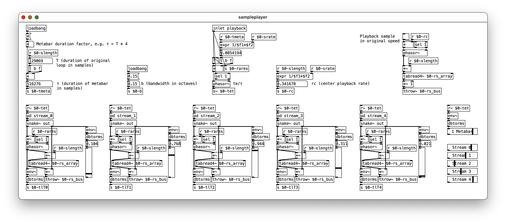

# Risset Sampler for PD

## Risset eternal accelerando
[Jean-Claude Risset](https://en.wikipedia.org/wiki/Jean-Claude_Risset) described the auditory illusion of an "eternal accelerando", where, similar to Shepard tones for pitch, a rhythm can be structured and played back in a way that creates the [perception of constant acceleration](https://pubs.aip.org/asa/jasa/article-abstract/80/3/961/680513/Pitch-and-rhythm-paradoxes-Comments-on-Auditory?redirectedFrom=fulltext).

In his 2011 paper ["Scheduling and composing with Risset eternal accelerando rhythms"](./assets/Stowell2011icmc.pdf), Dan Stowell provided a solution for implementing eternal accelerandos on (rhythmic) audio samples by employing variable play back rates and amplitudes distributed to a number of sample play back streams that run synchronized.

## Implementation for Pure Data
**Risset Sampler** is a Pure Data implementation of an eternal accelerando following Stowell's paper.

In the patch, there are 5 streams set up to play back the same drum loop sample in different rates and amplitude to generate the eternal accelerando effect.

The individual play back rates and depending amplitude envelopes for each stream are calculated with Stowell's formulas (2) and (3) in the *pd streamX* subpatches.

## Examples
Three examples for Risset eternal accelerando rhythms from the implementation can be seen on [YouTube](https://www.youtube.com/watch?v=EQGDyMw1bW)

## Observations, open issues and questions:
1. There is an uncertainty concerning the unit of parameter "b" (bandwidth of octaves). The observation is, that for the test audio samples, values < 1 work best to achieve the required auditory effect, there also seems to be a sweet spot around the value of 0.15 for the sample provided in this repository.
2. The duration of the metabar τ is currently calculated by multiplying the sample duration T by a factor > 1. Doubling the amount of bars in a given (fixed 4/4 * 2 bars length) test audio sample seem to yield the most convincing results. There's more clarification needed whether τ = T * 4 can be generalized.
3. Depending on "b", amplitude powers seem to become erratic in such way that values generated on (lower) streams are glued to 0.841 (due to the +/- π clipping and following calculations in p(r)). The general question regards the intended flexibility of the parameters (or whether they need to be determined/ fixed depending on the source sample).
